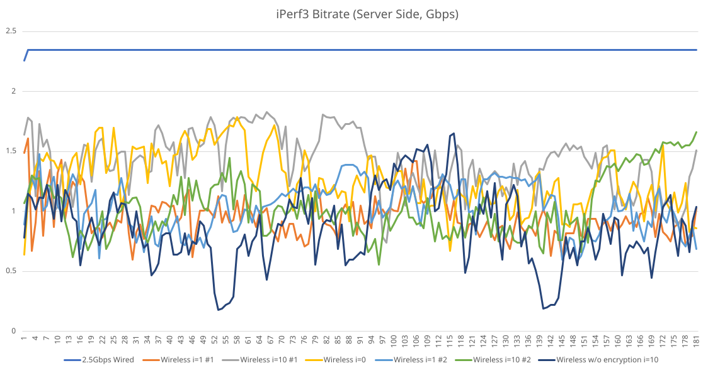

# Starter Experiment

## Network Topology

The baseline is two computers directly connected with 2.5Gbps Ethernet.

The experiments' topology is almost the same as [README](README.md), except the Wired connections are at 2.5Gbps.

## Configuration Files

Same as [README](README.md), except the experiment without SAE.

## Results

### iPerf3

#### Client
```
iperf3 -c <IP> -f M -i <INTERVAL> -t 180
```
The INTERVAL varies among 0, 1 and 10.

#### Server
```
iperf3 -s -B <IP> -4
```

### Bitrates

| Max  | Min  | Mean |      Note        |
|------|------|------|------------------|
| 2.35 | 2.26 | 2.35 | 2.5Gbps Wired    |
| 1.61 | 0.60 | 0.96 | Wireless i=1 #1  |
| 1.83 | 0.74 | 1.42 | Wireless i=10 #1 |
| 1.79 | 0.64 | 1.27 | Wireless i=0     |
| 1.48 | 0.59 | 1.04 | Wireless i=1 #2  |
| 1.66 | 0.56 | 1.04 | Wireless i=10 #2 |
| 1.65 | 0.18 | 0.86 | Wireless w/o SAE |

#### Notes
During the experiment of testing wireless without SAE, we have tried to check if the electromagnetic shielding affect the result.
However, it is possible that the long interval (10s) has buffered the impact. We cannot observe the corresponding response of shielding.
