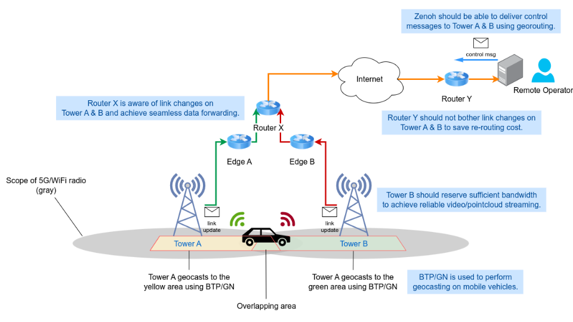

# The Goal of The Project

This project focuses on the study of the construction of the vechile
network based on named data networking semantics using emerging
technologies. It idea is to locate data pieces using rich path
expressions instead of addresses to support multi-vehicle monitoring
and remote control. The targeted scenario is illustrated as follows.

## The Technologies to Be Used

### Time-sensitive Network and Linux QDISCs

Time-sensitive Network is a set of standards from IEEE 802.1 working
group. It compiles basic constructs to build a network that with
advanced congestion control and latency guarantees. The components
include gating, priority selection policies and shapers. The
impplementation is mostly done by Linux QDISCs in this project. QDISC
is a part of Linux traffic control (TC) that allows users to define
queing policies, filters and gating control on network devices.

### Zenoh

Zenoh acts as a middleware that allow devices to communicate through
publication/subscription manner, in which data is named by a path
expression. It detangles the data content and the actual address of
network peers. In this way, the data sources are discovered through a
discovery mechanism and the connections are established
afterwards. The application using Zenoh simply provide the names of
data that is desired or is provided by the peer.

### ETSI C-ITS nad Vanetza

ETSI C-ITS is a set of standards to describe the construction of
intelligent transport system (ITS) in Europe. It defines the concepts,
protocols and message formats used in the ITS system. In this project,
the GeoNetworking protocol and Basic Transport Protocol (BTP) are used
to achieve geographical data transport.

## Challenges

### The Integration of High-Level Zenoh Network and C-ITS Protocols

The integration work is necessary for userspace programs to access
remote vehicle and cloud services through the standard C-ITS vehicle
network. The challenge is to bridge the seemly differenct concept
among the higher and lower layers. For example, the single-hop
geocasting is defined in C-ITS GeoNetworking, but the Zenoh does not
has the capability yet.

### Data Transmission Reliability under Vehicle Mobility Assuptions

The current network architecture totally replies on 5G/LTE to process
the mobility status of vehicles, which is not address by the Zenoh
middleware. The applications above could experience temporary data
outage due to the transfer of base stations and route changes. On the
other hand, the current Zenoh routing algorithm does not process the
case of high-fequent route change.
