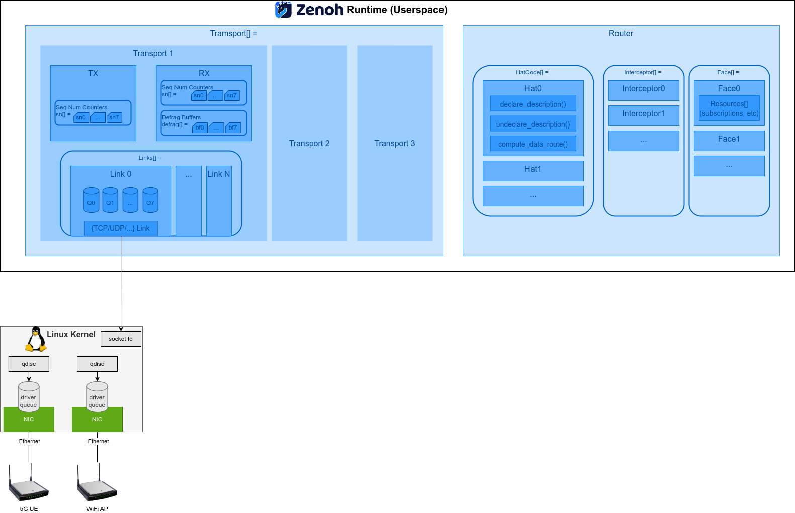

# Zenoh Internals

This chapter gives a brief overview of internal components in
Zenoh. The basic components is shown in the figure below.

## Zenoh I/O - Transports and Links

A **transport** tracks a high-level relation to a Zenoh peer on the
network, which maintains one or more **links** toward that peer. A
**link** is a basic unit of network connection, such as a TCP, a UDP
or an UNIX domain socket.

As you can see in the figure, a tranport has a RX head and a TX head,
respectively serve for data ingress and egress work loads. Both heads
contain 8 sequence number counters for 8 levels of priorities.

A transport also stores a list of related links. Each link has a
pipeline of 8 queues attached beforehand (named `TrasnmissionPipeline`
in source code), each serving for a respective priority. In this
pipeline, the messages to be sent are arranged into batches, and the
batches are later sent to the socket wrapped in the link struct.

## Routing

Zenoh provides several routing strategies named **Hat Code**. Each Hat
Code provides functions to update the route table and to compute the
routes.

- Client
- Router
- P2P Peer & Link-State Peer

In the network, each peer can be one of *router*, *peer* and *client*
roles. The router peers uses the Router Hat Code, while client peers
uses the Client Hat Code. The Router peers performs link-state routing
among the other router peers. The client peers do not perform any
routing computation, but simply forward messages to a preassigned
router peer.

When a peer acts in a *peer* role, it has two Hat Code to use, the P2P
and Link-State. In P2P mode, the peers assume that every peer in the
network is directly reachable. In Link-State mode, each peer performs
link-state routing algorithm and each peer maintains a netowrk graph
internally.
