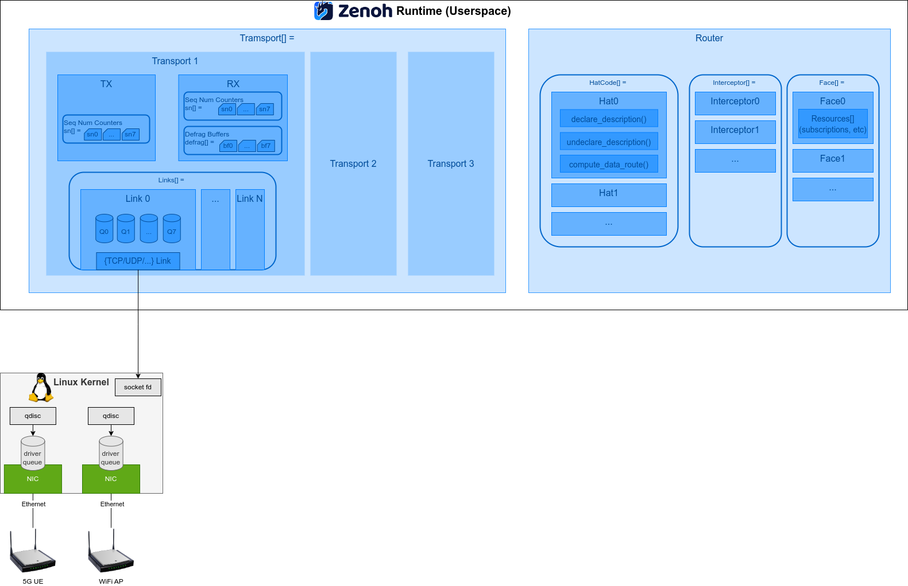

# Zenoh Internals

This chapter gives a brief overview of internal components in
Zenoh. The basic components is shown in the figure below.

The chapter is organized into these subsections. Please follow the
links to learn about their details.

- [Data Transport](./2.2-zenoh_io.md)
- [QoS Parameters](./2.2-zenoh_qos.md)
- [Routing](./2.3-zenoh_routing.md)

