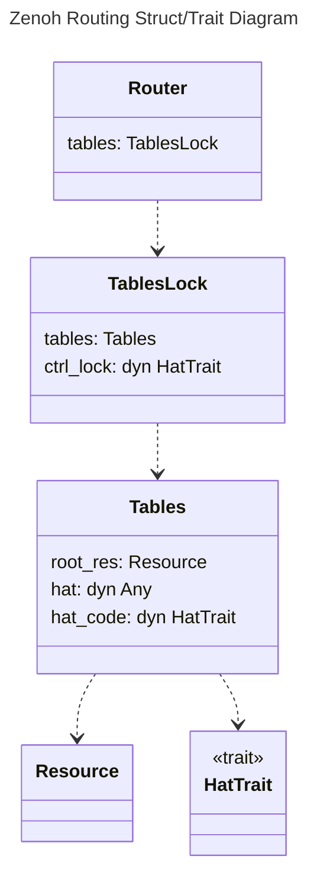
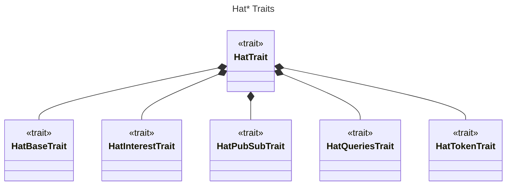

# Routing in Zenoh

Zenoh provides several routing strategies. Each provides functions to
update the route tables and to compute the routes. Here are known
routing strategies implemented in Zenoh.

- Client
- Router
- P2P Peer & Link-State Peer

Each routing strategy is implemented as a **HatCode** object. It
provides the routing message processing and defines customized routing
tables format.

The strategies correspond to one of *router*, *peer* and *client*
roles. The Router peers performs link-state routing among the other
router peers. The client peers do not perform any routing computation,
but simply forward messages to a preassigned router peer. When a peer
acts in a *peer* role, it has two Hat Code to use, the P2P and
Link-State. In P2P mode, the peers assume that every peer in the
network is directly reachable. In Link-State mode, each peer performs
link-state routing algorithm and each peer maintains a netowrk graph
internally.

## HatCode Objects

The **HatCode** in Zenoh implements the ~HatTrait~.

 
