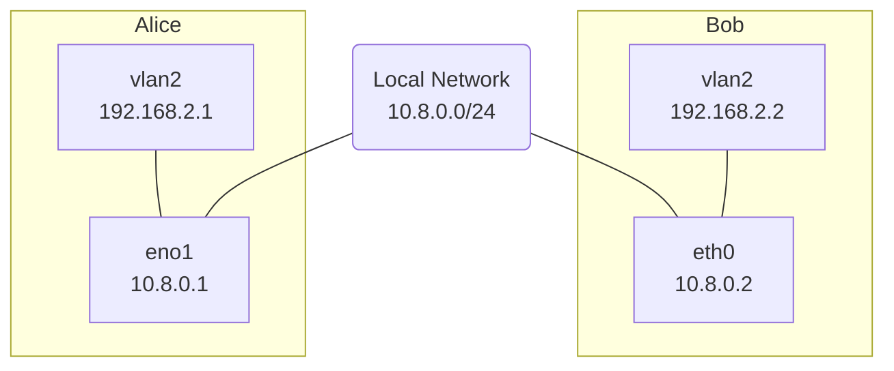

# Time-Sensitive Network (TSN) on Linux

The work was done under the cooperation of NEWSLAB, National Taiwan
University and ADLINK Corp. Most of the content are copied from the
[TSN tutorial on
ADLINK](https://tsn-tutorial.readthedocs.io/en/latest/).

The time-sensitive network (TSN) is a collection of standards built
atop of standard Ethernet that describes a reliable and low-latency
network architecture based on layer 2 IEEE 802.1Q VLAN. It approaches
the latency control in many aspects, including time synchronization,
priority selection, traffic shaping and capacity reservation. Each of
them contributes to a portion of the overall network.

This chapter introduces a practical TSN setup using commodity hardware
done in a combination of VLAN, Linux TC and userspace tools. This
setup allows the network packets to carry extra priority information
from one host to another. The Linux kernel can then applies traffic
control using the priority information on packets. The mapping among
application-level QoS and traffic control policies are studied to
enable further userspace integration. In the following article, the
following topics will be covered.

1. Priority translation

    Introduce the priority settings in each network layer and mapping
    among them.

2. Gating and queuing control using Linux TAPRIO

    It focues on tc-taprio(8) buitin the Linux kernel using the
    priority information.

3. Application QoS and traffic control policies

    Describe the application QoS in ROS and Zenoh and their connection
    to Linux TC policies.

## Using TSN-enabled Network Cards

The network card must meet certain requirements to support traffic
control on Linux. The details are described in the section.

[Network Hardware](3.1-network_hardware.md)
 
## Priority Translation

The priority is used to mark the urgentness of the data packets, which
presents in each layer of protocols for slightly different
purposes. The The details are described in the section.

[Priority Translation](3.2-priority_translation.md)

## Gating and Queing using Linux TAPRIO

## Architecture

## Benchmark

The effectiveness of 
