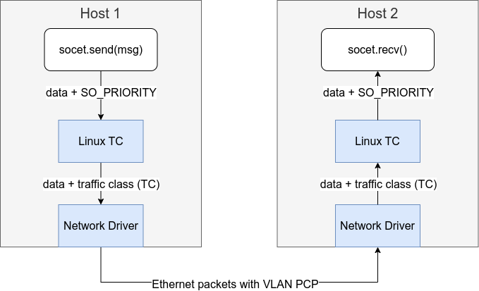

# Priority Translation

The priority is used to mark the urgentness of the data packets, which
presents in each layer of protocols for slightly different purposes.



- Zenoh priority in userspace

    It is an internal priotiy defined in the Zenoh network.

- Linux socket priority

    The priority is used within the Linux system, which are respected
    by Linux traffic control (TC) policies priority.

- Traffic class

    The traffic class on marked on packets on TX hardware queue. The
    Linux kernel maps the socket priorities to traffic classes before
    putting them to hardware queues.

- VLAN Priority Code Point (PCP)

    The priority number is labeled in the VLAN header, which enables
    layer 2 queing and traffic control defined in IEEE 802.1Q
    standard.


# Priority Mapping Practices

## Setting Socket Priority in Programs

In this TSN network, the application is responsible for providing
desired priority on data packets.  The standard method is to configure
the `SO_PRIORITY` option on sockets using the `setsockopt` system
call.  Here are C and Rust examples.

In the C programming language, the socket is represented by a file
descriptor.  The file descriptor and the priority number are provided
to `setsockopt()`.

```c
#include <sys/socket.h>

// Open a socket
int fd = socket(AF_INET, SOCK_STREAM, 0);

// Set the SO_PRIORITY to 6
int priority = 6;
int ret = setsockopt(fd, SOL_SOCKET, SO_PRIORITY, &priority, sizeof(priority));
if (ret < 0) { /* error */ }
```

In the Rust programming language, a TCP connection is created by a
`TcpStream` and the underlying file descriptor is obtained from the
stream.  We call the `setsockopt()` from the
[nix](https://crates.io/crates/nix) library to configure the socket
priority.

```rust
use nix::sys::socket::{sockopt::Priority, getsockopt, setsockopt};
use std::net::TcpStream;
use std::os::unix::io::AsRawFd;

// Create a TCP socket
let mut stream = TcpStream::connect("11.22.33.44")?;

// The the underlying file descriptor of the socket.
let fd = stream.as_raw_fd();

// Set SO_PRIORITY to 6.
setsockopt(fd, Priority, 6)?;
```

### Mapping Socket Priority to Traffic Classes

The traffic classes are respected by hardware queues within network
cards. This is an example TAPRIO qdisc policy configured on physical
network device `eth0` the device.

```sh
sudo tc qdisc replace dev eth0 parent root handle 100 taprio \
                     num_tc 3 \
                     map 2 2 1 0 2 2 2 2 2 2 2 2 2 2 2 2 \
                     queues 1@0 1@0 1@0 \
                     base-time 1528743495910289987 \
                     sched-entry S 01 300000 \
                     sched-entry S 02 300000 \
                     sched-entry S 04 400000 \
                     flags 0x1 \
                     txtime-delay 200000 \
                     clockid CLOCK_TAI 
```

Here is the break down of the command.

- `num_tc`: number of traffic class
- `map`: The relationship between Linux priority and traffic class.


- `queue`: The queues in "count@offset" notation specifies the queue
  range for each traffic class. According to the official
  documents, the ranges should not overlap and must be a contiguous
  range of queues.

- `flags` configures the mode of operation.  It can be 0x1 or
  0x2. Enabling the execution of the Task Admission Control (TAS)
  functionality either in software or hardware.


### Mapping Socket Priority to VLAN PCP

This command line creates a virtual VLAN device named `vlan1` with
socket priority to VLAN PCP mappings for egress packets. This exmaple
simply maps socket priority 0 to PCP 1, socket priority 1 to PCP 1 and
so on.

```sh
sudo ip link set dev vlan1 type vlan egress 0:0 1:1 2:2 3:3 4:4 5:5 6:6 7:7
```
