# Benchmark

## Tested Scenario

The benchmark assumes a remote driving scenario, in which an operator
controls a remote vehicle. The vehicle uploads a live camera and point
cloud stream, while the operator sends control commands to the
vehicle.

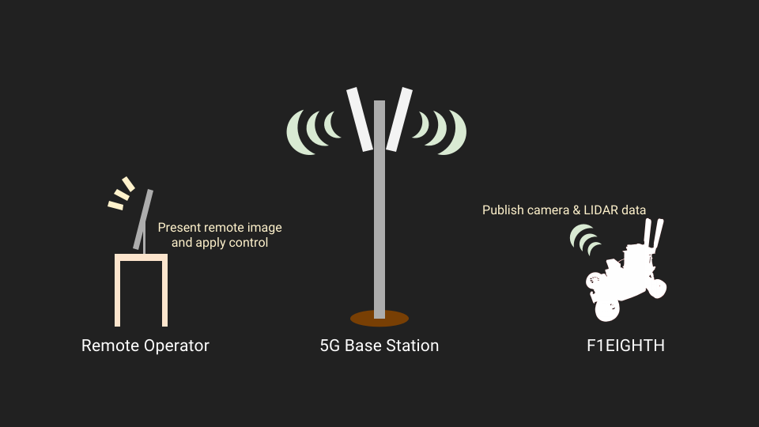

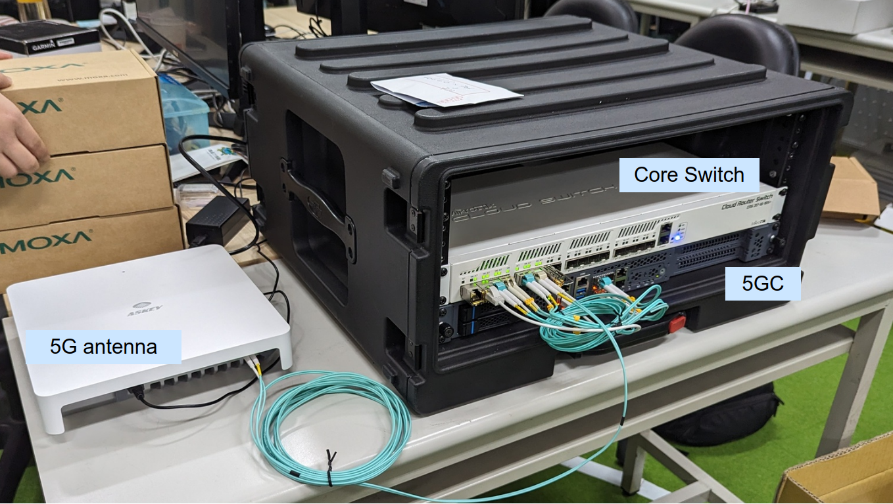

## Message Payload Characteristics

- Control Messages
    - **Message Size**: Typically small (e.g., a few bytes to tens of bytes), as it often includes control commands or instructions.
    - **Message Rate**: High frequency, usually sent multiple times per second (e.g., 10-100 msg/s) to ensure real-time control.
    - **Latency Sensitivity**: Extremely low latency required, as delayed control messages could result in unsafe operations.
    - **Reliability Requirement**: High reliability to avoid control errors.
- Camera Feed
    - **Message Size**: Large, as each message might contain image or video data. Size can range from kilobytes (KB) to megabytes (MB), depending on resolution and compression.
    - **Message Rate**: Moderate to high frequency, depending on the frame rate (e.g., 15-60 frames per second, each frame being one message).
    - **Latency Sensitivity**: Moderate latency tolerance, though real-time feedback is still important.
    - **Reliability Requirement**: Moderate to high reliability, as missing frames may degrade video quality but not disrupt overall system functionality.
- Point Cloud Data
    - **Message Size**: Very large, as point cloud data contains 3D spatial coordinates. Size can range from hundreds of kilobytes (KB) to several megabytes (MB) per message.
    - **Message Rate**: Lower frequency, typically a few messages per second (e.g., 1-10 msg/s) depending on the system’s sensor capture rate.
    - **Latency Sensitivity**: Moderate, as point cloud data is often used for mapping or object detection.
    - **Reliability Requirement**: High reliability needed for accurate environmental mapping and object recognition.
- Vehicle Status Updates
    - **Message Size**: Small (e.g., a few bytes), as it typically includes parameters such as speed, acceleration, and fuel levels.
    - **Message Rate**: High frequency, sent multiple times per second (e.g., 10-50 msg/s) for real-time monitoring of the vehicle's condition.
    - **Latency Sensitivity**: Low latency required to ensure that the system has up-to-date information about the vehicle’s status.
    - **Reliability Requirement**: High reliability to avoid inaccurate status reporting.

## Message Payload Requirements

| Type        | Min Bits/s rate | Production Interval (ms) | Payload Size (Bytes) | Delay Constraint (Di) | Reliability Constraint (Ri) |
|:------------|----------------:|:------------------------:|:--------------------:|---------------------------------:|:--------------------------------------:|
| Control     |              1K | 100                      | 128                  |                               50 | 99.99%                                 |
| Camera      |              4M | 33.33                    | 1K                   |                              100 | 99%                                    |
| Point Cloud |             16M | 100                      | 1K                   |                              200 | 99.9%                                  |
| Camera      |              5K | 100                      | 128                  |                              100 | 99%                                    |

## The Effectiveness of TAPRIO

| With TAPRIO? |                                               |
|--------------|-----------------------------------------------|
| Yes          | 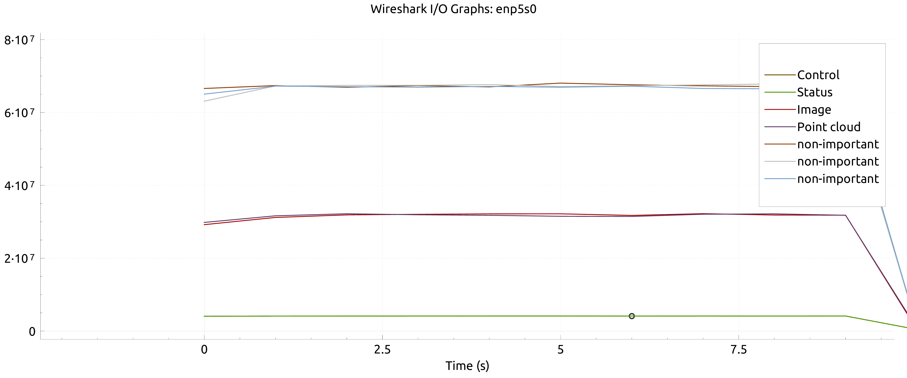 |
| No           | 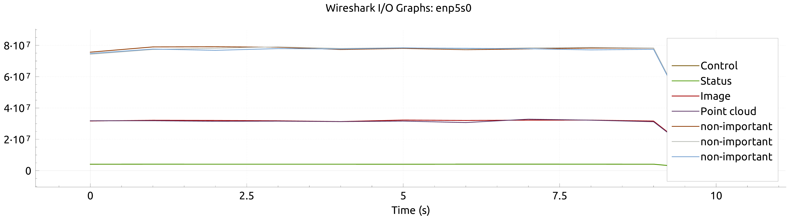       |

## The Effectiveness of Signal Strength

### Under General Signal Condition

| Message Class | Without TAPRIO                                   | With TAPRIO                                     |
|---------------|--------------------------------------------------|-------------------------------------------------|
| Control       | 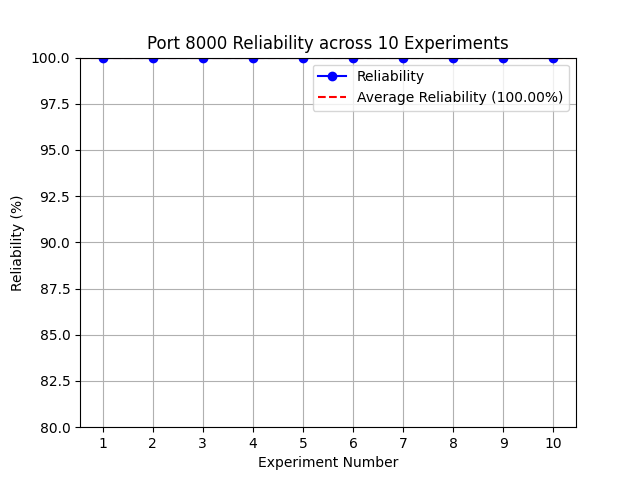 |  |
| Camera        | 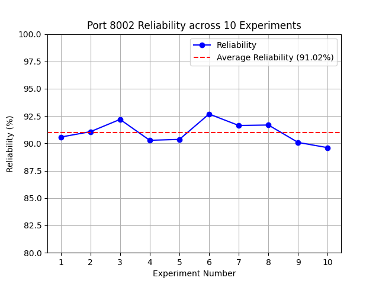 |  |
| Point Cloud   | 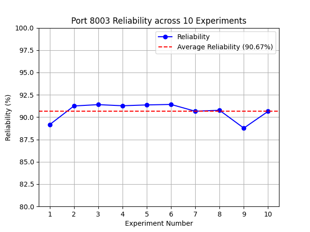 |  |
| Status        |  |  |

### Under Good Signal Condition

| Message Class | Without TAPRIO                                | With TAPRIO                                  |
|---------------|-----------------------------------------------|----------------------------------------------|
| Control       | 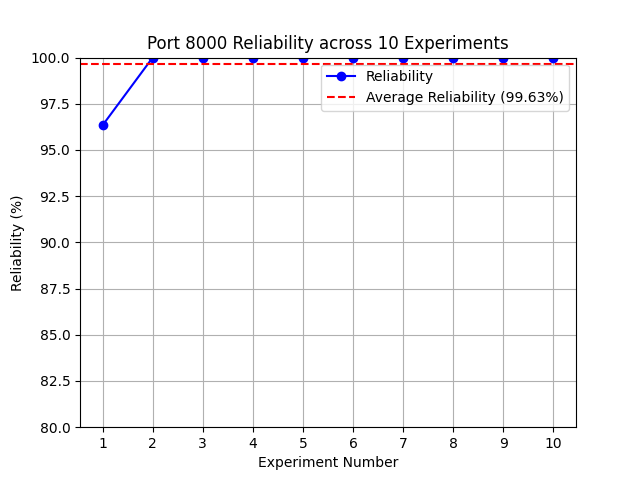 | 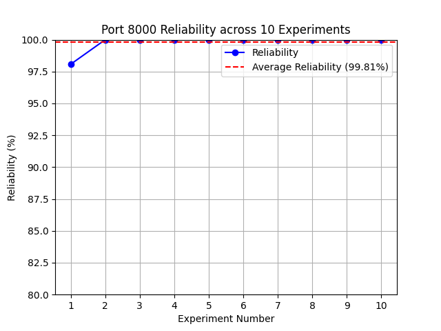 |
| Camera        | 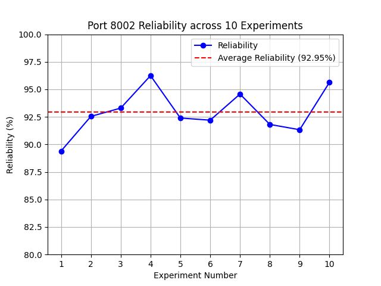 |  |
| Point Cloud   | 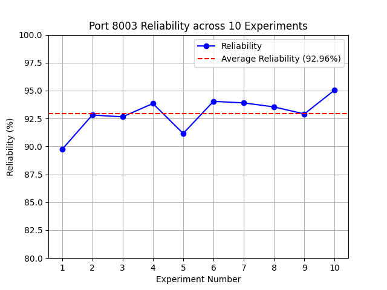 |  |
| Status        | 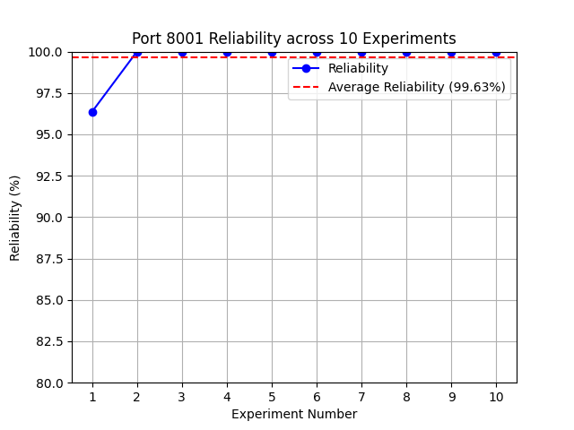 |  |

