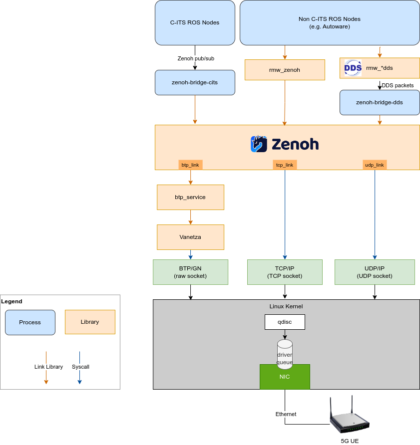

# ETSI C-ITS on Zenoh

The work aims to enable the vehicle-to-vehicle communication
capability on Zenoh, in which the European C-ITS standard is
preferred. It resues the protocols and data format already implemented
in the Vanetza project ([doc](https://www.vanetza.org/)). There are
two major works planned in the project.

1. Integrate the BTP/GN network stack from Vanetza as the replacement
   of TCP/IP on Zenoh. It enables high-level applications to process
   vehicle-to-anything messages in a native way, and enables
   geographical data multicast and peer discovery.
2. The Zenoh routing algorithm should be modified to recognize the
   movement of vehicles according to geographical information.

## Architecture

The overall architecture is shown in the figure below. The BTP/GN
stack will be added to Zenoh apart from existing TCP/IP stack. A
dedicated Zenoh-to-C-ITS brige will be implemented to process messages
defined in ETSI C-ITS.

## BTP Integration in Rust and Zenoh

This is a working-in-progress task to add BTP/GN link to Zenoh. The
initial step is to implement the Rust interface for Vanetza's C++ BTP
socket. The code implementqation can be found in the
vanetza-btp-service repository.

[vanetza-btp-service](https://github.com/NEWSLabNTU/vanetza-btp-service/)
